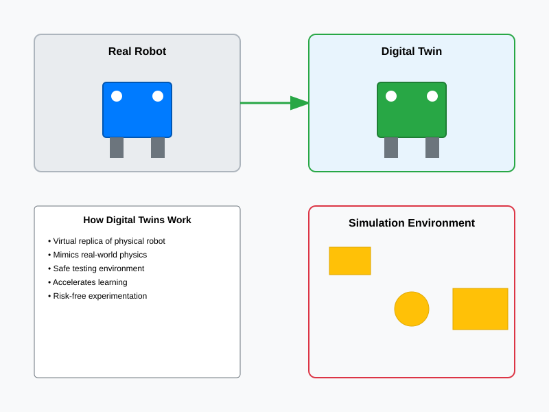

# Chapter 1: Introduction to Digital Twins

## What is a Digital Twin?

A digital twin is a **virtual representation** of a physical robot and its environment. Think of it as a "digital shadow" or "virtual twin" that mirrors the real robot's characteristics, behaviors, and interactions.

In robotics, a digital twin serves as a **bridge between the design phase and real-world deployment**. It allows engineers, researchers, and students to understand, test, and improve robot behaviors in a safe, virtual environment before the physical robot ever moves in the real world.

## The Core Concept: Virtual Practice Spaces

Imagine if pilots had to learn to fly by immediately getting into real airplanes. The risks would be enormous, and the learning curve would be incredibly steep. That's why flight simulators were invented – to provide a safe, controlled environment for learning and practicing.

Digital twins serve the same purpose for robots. They provide **virtual practice spaces** where:

- Robots can learn new behaviors without risk of physical damage
- Different scenarios can be tested repeatedly
- Interactions with environments can be observed and analyzed
- Potential problems can be identified and fixed before real-world deployment

## Key Characteristics of Digital Twins

### 1. **Fidelity**
Digital twins are designed to closely match the physical characteristics of their real-world counterparts. This includes:
- Physical dimensions and appearance
- Movement capabilities and limitations
- Sensor configurations and ranges
- Processing power and response times

### 2. **Connectivity**
Many digital twins maintain a connection with their physical counterparts, allowing for:
- Real-time data synchronization
- Performance monitoring
- Predictive maintenance
- Behavior optimization

### 3. **Interactivity**
Digital twins allow for interaction with:
- Virtual environments that mirror real ones
- Simulated objects and obstacles
- Virtual humans and other agents
- Various environmental conditions

## Why Digital Twins Matter in Robotics

### Safety First
Digital twins eliminate the risk of physical damage during testing and learning phases. Robots can make mistakes, collide with objects, or behave unexpectedly without any real-world consequences.

### Accelerated Learning
Time can be compressed in digital environments, allowing robots to gain experience much faster than would be possible in real time. What might take months of real-world testing can be accomplished in hours of simulation time.

### Cost Effectiveness
Physical robots are expensive to build and maintain. Digital twins allow for extensive testing without wearing out mechanical parts, consuming power, or requiring physical space.

### Scenario Exploration
Digital twins enable testing of rare or dangerous scenarios that would be impossible or unethical to recreate in the real world, such as emergency situations or extreme environmental conditions.

## Common Applications

Digital twins are used across various robotics applications:

- **Manufacturing**: Testing assembly line robots before deployment
- **Healthcare**: Training surgical robots and assistive devices
- **Autonomous Vehicles**: Testing navigation and safety systems
- **Space Exploration**: Preparing robots for alien environments
- **Education**: Teaching robotics concepts safely and affordably

## The Digital Twin Lifecycle

The relationship between digital twins and physical robots typically follows a lifecycle:

1. **Design Phase**: The digital twin is created based on robot specifications
2. **Testing Phase**: Extensive testing and refinement occur in simulation
3. **Deployment Phase**: The physical robot is built and deployed based on simulation results
4. **Operation Phase**: The digital twin may continue to mirror and optimize the physical robot
5. **Iteration Phase**: Lessons learned feed back into future designs

## Visualizing Digital Twins

*The diagram above illustrates the relationship between a physical robot and its digital twin, showing how the virtual representation exists within a simulated environment.*

## Real-World Analogies

Understanding digital twins becomes easier with familiar analogies:

- **Flight Simulators**: Like pilots training in simulators before flying real aircraft
- **Video Games**: Like characters interacting in virtual worlds with simulated physics
- **Architectural Models**: Like scale models that represent full-sized buildings
- **Medical Simulators**: Like mannequins used to train medical professionals

## Key Takeaways

- Digital twins are virtual representations of physical robots and their environments
- They provide safe, cost-effective testing and learning environments
- They accelerate the development and deployment of robotics systems
- They bridge the gap between theoretical design and practical implementation
- They are widely used across robotics applications and industries

In the next chapter, we'll explore how physics simulation brings these virtual environments to life, making them realistic and useful for robot training and testing.