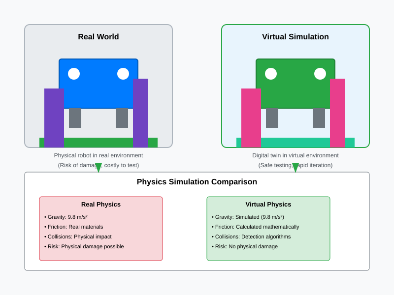

# Chapter 2: Physics Simulation and Environment Modeling

## Understanding Physics Simulation

Physics simulation is the cornerstone of effective digital twin environments. It's the technology that makes virtual worlds behave in ways that closely resemble the real world. Without accurate physics simulation, robots trained in digital environments would struggle when deployed in the real world.

At its core, physics simulation involves **mathematical modeling of physical laws** such as gravity, friction, collision, and momentum. These models create the foundation for realistic interactions between robots and their virtual environments.

## Core Physics Concepts in Simulation

### Gravity Simulation

Gravity is perhaps the most fundamental force that robots must contend with in the real world. In digital twin environments, gravity simulation ensures that:

- Objects fall at realistic rates (approximately 9.8 m/s² on Earth)
- Robots experience weight and downward force
- Physical interactions follow realistic trajectories
- Stability and balance challenges mirror real-world conditions

**Real-World Comparison**: Just as in reality, a robot's center of gravity affects its stability, and heavy objects are harder to move than light ones.

### Movement Mechanics

Movement in simulation encompasses both **translation** (linear motion) and **rotation** (angular motion). Accurate movement simulation includes:

- **Translation**: Forward/backward, left/right, up/down movements
- **Rotation**: Turning, spinning, and orientation changes
- **Kinematics**: The mathematical relationships between position, velocity, and acceleration
- **Dynamics**: How forces affect movement and motion

**Real-World Comparison**: Like real robots, virtual robots must account for momentum, acceleration limits, and motor constraints.

### Collision Detection and Prevention

One of the most critical aspects of physics simulation is detecting when objects come into contact with each other. Collision systems must:

- **Detect Intersections**: Identify when two or more objects occupy the same space
- **Calculate Forces**: Determine the impact and resulting forces from collisions
- **Apply Responses**: Make objects react appropriately (bounce, stop, deform)
- **Prevent Penetration**: Ensure objects don't pass through each other unrealistically

**Real-World Comparison**: Just as physical objects can't occupy the same space simultaneously, digital objects must respect the same constraint.

### Friction and Resistance

Friction affects how robots interact with surfaces and objects:

- **Static Friction**: The force needed to start moving an object
- **Dynamic Friction**: The force that opposes continued motion
- **Rolling Friction**: Specialized friction for wheels and rolling elements
- **Air Resistance**: Drag forces that affect movement speed

**Real-World Comparison**: Robots pushing objects in simulation face the same resistance they would in reality.

## Building Virtual Environments

### Spatial Elements

Virtual environments contain the fundamental elements that robots interact with:

- **Floors and Ground**: The base surfaces that provide support
- **Walls and Boundaries**: Structures that define navigable spaces
- **Obstacles**: Objects that robots must navigate around
- **Interactive Elements**: Items that robots can manipulate or use

### Environmental Conditions

Beyond basic geometry, virtual environments can simulate various conditions:

- **Lighting**: Affects vision-based sensors and navigation
- **Weather**: Simulates rain, wind, or temperature effects
- **Terrain Variations**: Different surface types (smooth, rough, slippery)
- **Acoustic Properties**: Sound propagation and reflection

## The Role of Physics in Robot Learning

### Safe Testing Environment

Physics simulation creates a safe space where robots can:

- **Experiment Freely**: Try different behaviors without physical risk
- **Learn from Mistakes**: Experience consequences without real-world damage
- **Test Limits**: Push boundaries to understand capabilities and constraints
- **Practice Emergency Procedures**: Learn to recover from unusual situations

### Accelerated Learning

Physics simulation enables:

- **Time Compression**: Run simulations faster than real-time
- **Scenario Repetition**: Repeat the same conditions multiple times
- **Parameter Variation**: Test different environmental conditions
- **Failure Analysis**: Study what went wrong and why

## Real-World Comparisons

### Video Game Physics

Modern video games provide familiar examples of physics simulation:

- **Gravity**: Characters fall realistically when jumping
- **Collisions**: Objects bounce, break, or slide appropriately
- **Fluid Dynamics**: Water and air movement looks realistic
- **Vehicle Physics**: Cars handle with realistic acceleration and turning

### Flight Simulator Physics

Flight simulators demonstrate sophisticated physics modeling:

- **Aerodynamics**: Airflow over wings creates lift
- **Engine Dynamics**: Thrust responds to throttle inputs
- **Environmental Effects**: Wind, turbulence, and weather
- **Instrument Accuracy**: Flight instruments reflect physical reality

## Visual Representation of Physics Concepts

*The diagram above compares how physics operates in real-world environments versus virtual simulation environments.*

## How Simulation Prevents Damage and Speeds Up Learning

### Damage Prevention

Physics simulation eliminates many risks:

- **Physical Damage**: No broken parts or worn components
- **Environmental Damage**: No destruction of real-world objects
- **Human Safety**: No risk to people working with robots
- **Financial Protection**: No repair or replacement costs

### Learning Acceleration

Simulation dramatically speeds learning:

- **Time Compression**: Hours of simulation in minutes of real time
- **Parallel Testing**: Multiple scenarios tested simultaneously
- **Instant Reset**: Return to previous states instantly
- **Precise Control**: Exact reproduction of conditions

## Key Takeaways

- Physics simulation is essential for realistic digital twin environments
- Core concepts include gravity, movement, collisions, and friction
- Virtual environments must accurately model real-world physics
- Simulation enables safe testing and accelerated learning
- Real-world analogies help understand physics simulation concepts
- Proper physics modeling ensures transferability from simulation to reality

In the next chapter, we'll explore how high-fidelity digital worlds enhance human-robot interaction testing and evaluation.